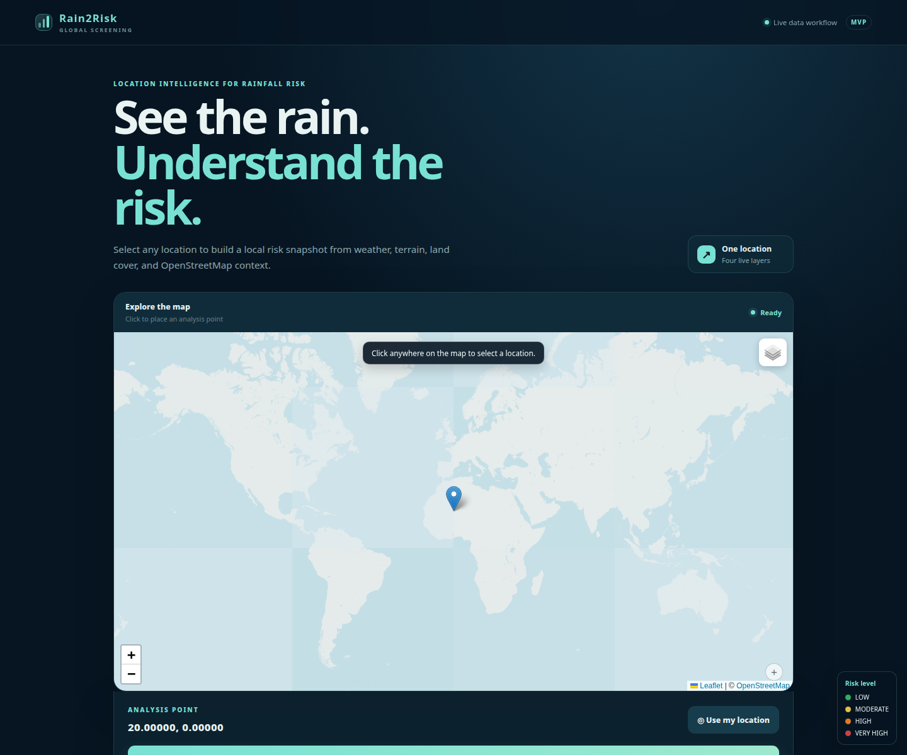
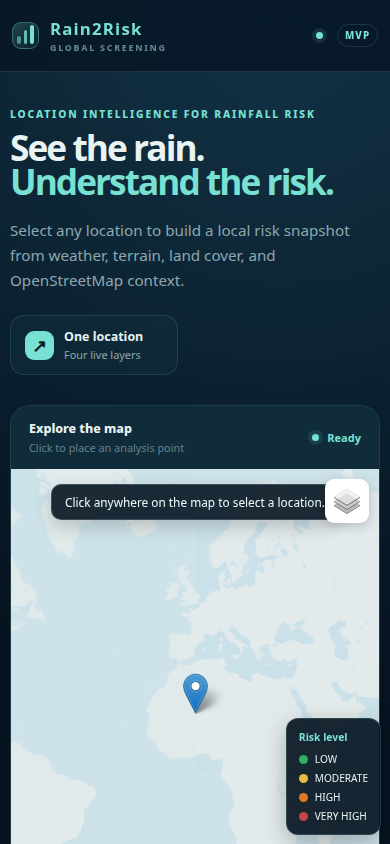
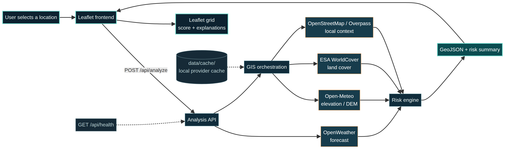
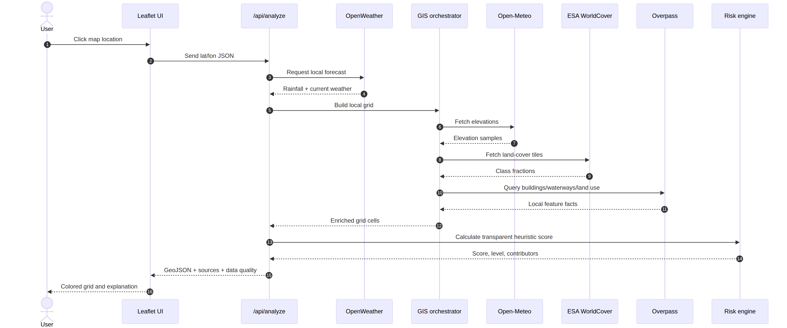

# Rain2Risk operations and runtime proof

## What the application actually does

Rain2Risk accepts a latitude and longitude from the Leaflet map. The active API validates the coordinates, requests a location-level OpenWeather forecast, builds a local grid, and orchestrates three geographic layers: Open-Meteo elevation, ESA WorldCover land-cover classes, and OpenStreetMap/Overpass context such as buildings and waterways. The risk engine combines the available weather and geographic features using the existing heuristic methodology. The API then returns a GeoJSON FeatureCollection, a selected-cell risk summary, source names, and data-quality metadata. The frontend renders the colored grid, selected-cell metrics, contributors, and explanation text.

The weather forecast is retrieved once for the selected location; it is not independently measured for each grid cell. Geographic values are associated with the local grid cells. When a provider cannot supply a required layer, the response reports the layer as unavailable rather than inventing a value.

## Runtime endpoints

| Endpoint | Purpose | Expected evidence |
|---|---|---|
| `GET /api/health` | Confirms the Python service is alive. | JSON containing `{"status": "ok", "service": "rain2risk"}`. |
| `POST /api/analyze` | Runs the complete analysis orchestration. | JSON containing `location`, `weather`, GeoJSON `grid`, `risk`, `sources`, and `data_quality`. |
| `/` | Serves the interactive Leaflet frontend. | HTTP 200 HTML response and a rendered map interface. |

## Commands

Run all offline checks from the repository root:

```bash
python scripts/verify_project.py
```

This command runs Python compilation, the offline unit-test suite, and JavaScript syntax validation. It does not require provider access.

Run the one-location orchestration directly when an OpenWeather key and network access are available:

```bash
python scripts/orchestrate_analysis.py --lat 35.6762 --lon 139.6503 --output docs/run-output/tokyo.json
```

Run the multi-location live smoke test separately:

```bash
python scripts/global_smoke_test.py
```

The smoke test checks the real pipeline for Tunis, Tokyo, New York, Dhaka, and Amsterdam. It reports pass/fail JSON lines and does not claim success if an external service is unavailable.

## Visual proof of the running interface

The following screenshots were captured from the running local server after the frontend refresh:





The desktop and mobile captures verify that the branded interface is served successfully, the map shell renders, the analysis controls are visible, and the responsive layout adapts to a narrow viewport. A live provider analysis was not faked in these static captures; provider-backed result evidence requires the optional smoke command and valid credentials.

## Architecture and workflow diagrams



The architecture diagram shows the canonical frontend → API → providers → risk engine → GeoJSON path. The sequence diagram below shows the runtime order of requests and responses.



The Mermaid source files are kept beside the rendered images so the diagrams remain editable and auditable:

```text
docs/architecture-clean.mmd
docs/analysis-workflow.mmd
docs/architecture-clean.png
docs/analysis-workflow.png
```

## Troubleshooting

If `/api/health` does not return successfully, start the server from the repository root with `python backend/main.py` and check that port `8000` is available. If the UI loads but analysis fails, confirm `OPENWEATHER_API_KEY` in the private `.env` file and check the provider error shown in the status line. A provider failure is an operational limitation, not evidence that a successful analysis occurred.
